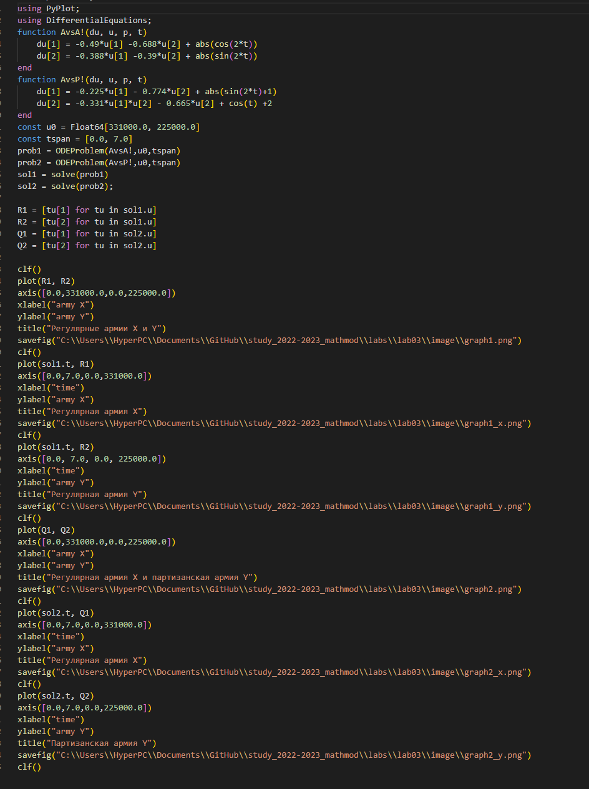
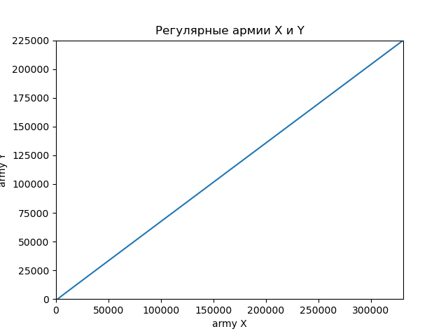
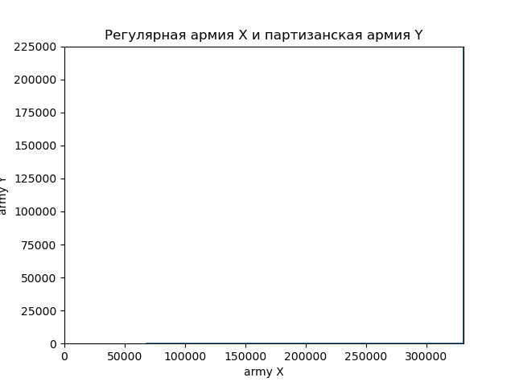
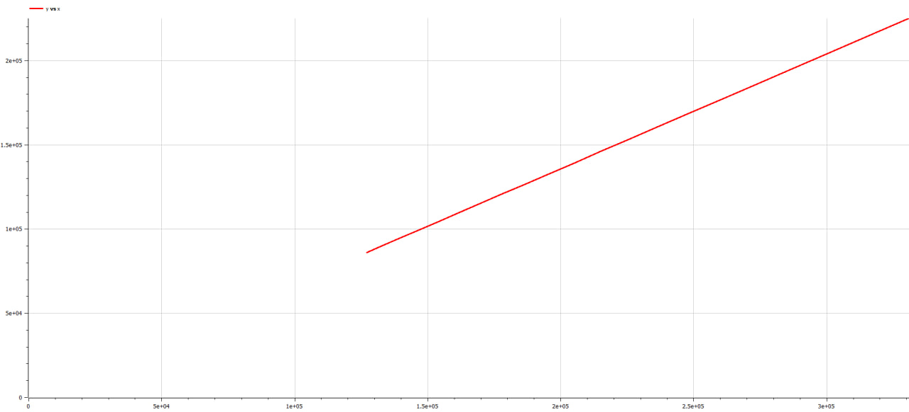
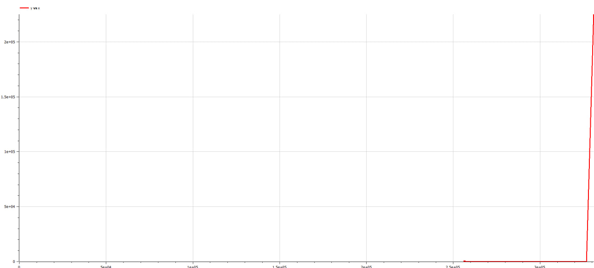

---
marp:true
---
## Цели и задачи

- Изучить модели Ланчестера для имитации боевых действий
- Записать на языках OpenModelica и Julia программы, которые бы решали данные задачи с возможностью вносить разные входящие данные
- Сравнить результат работы данных программ между собой

---

## Условия

1. Модель боевых действий между регулярными войсками:

$$ {dx\over {dt}} = -0,49x(t)-0,688y(t)+|cos(2t)| $$
$$ {dy\over {dt}} = -0,388x(t)-0,39y(t)+|sin(2t)| $$

2. Модель ведение боевых действий с участием регулярных войск и партизанских отрядов:

$$ {dx\over {dt}} = -0,225x(t)-0,774y(t)+|sin(2t)+1| $$
$$ {dy\over {dt}} = -0,331x(t)y(t)-0,665y(t)+cos(t)+2 $$

---

# Процесс работы

---

## Julia 

Был написан код на Julia 

---
График, построенные программамы для первой задачи.

 
---
График,программамы построенный для второго условия.

 
---
## OpenModelica 

Был написан код на OpenModelica

---
График, построенные программамы для первой задачи.

 
---
График,программамы построенный для второго условия.

 

