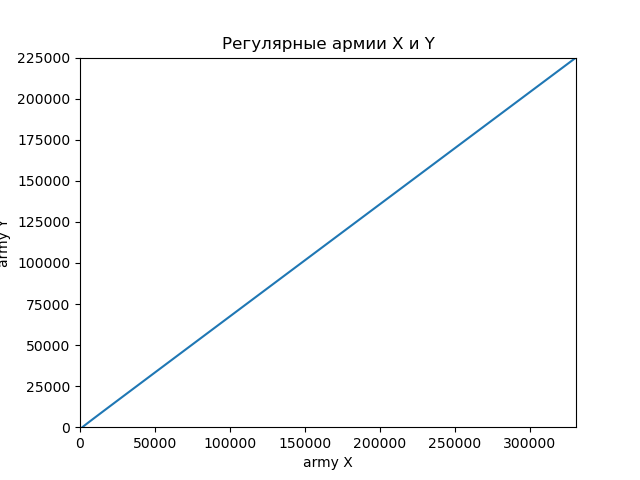

---
## Front matter
title: "Отчёт по лабораторной работе №3"
subtitle: "Предмет: Математическое моделирование"
author: "Носов А.А., НФИбд-01-20"

# Цель работы

Изучить модели боевых действий Ланчестера и применить их на практике для решения задания лабораторной работы. 

# Задание лабораторной работы
## Вариант №68 [@lab-task:mathmod]

Между страной Х и страной У идет война. Численность состава войск исчисляется от начала войны, и являются временными функциями $x(t)$ и $y(t)$. В
начальный момент времени страна Х имеет армию численностью $331 000$ человек, а в распоряжении страны У армия численностью в $225 000$ человек. Для упрощения модели считаем, что коэффициенты $a$, $b$, $c$, $h$ постоянны. Также считаем $P(t)$ и $Q(t)$ непрерывными функциями. 

Постройте графики изменения численности войск армии Х и армии У для следующих случаев:

1. Модель боевых действий между регулярными войсками:


2. Модель ведение боевых действий с участием регулярных войск и партизанских отрядов:


# Теоретическое введение

## Общая информация о модели

В данной лабораторной работе мы будем использовать простейшие модели боевых действий – модели Ланчестера. В противоборстве могут принимать участие как регулярные войска, так и партизанские отряды. В общем случае главной характеристикой соперников являются численности сторон. Если в какой-то момент времени одна из численностей обращается в нуль, то данная сторона считается проигравшей (при условии, что численность другой стороны в данный момент положительна).

Нам интересны два случая ведения боевых действий:

1. Боевые действия между регулярными войсками;
2. Боевые действия с участием регулярных войск и партизанских отрядов (где одна сторона представлена регулярной армией, а вторая представлена партизанскими отрядами).

## Регулярная армия X vs регулярная армия Y

Рассмотрим первый случай. Численность регулярных войск определяется тремя факторами:

- скорость уменьшения численности войск из-за причин, не связанных с боевыми действиями (болезни, травмы, дезертирство);
- скорость потерь, обусловленных боевыми действиями противоборствующих сторон (что связанно с качеством стратегии, уровнем вооружения, профессионализмом солдат и т.п.);
- скорость поступления подкрепления (задаётся некоторой функцией от времени).

В этом случае модель боевых действий между регулярными войсками описывается следующим образом[@lab-example:mathmod]:

$$ {dx\over {dt}} = -a(t)x(t)-b(t)y(t)+P(t) $$
$$ {dy\over {dt}} = -c(t)x(t)-h(t)y(t)+Q(t) $$

Пояснения:

- члены $a(t)x(t)$ и $h(t)y(t)$ описывают НЕ связанные с боевыми действиями потери армий X и Y соответственно;
- члены $b(t)y(t)$ и $c(t)x(t)$ описывают потери в боевых действиях армий X и Y соответственно;
- коэффициенты $b(t)$ и $c(t)$ указывают на эффективность действий каждого отдельно взятого солдата в армиях Y и X соответственно;
- коэффициенты $a(t)$ и $h(t)$ есть величины, которые указывают на степень влияния различных факторов на потери;
- члены $P(t)$ и $Q(t)$ учитывают подкрепления в течение некоторого фиксированного промежутка времени.   

В первом пункте нами рассматривается как раз такая модель. Она является доработанной моделью Ланчестера, так его изначальная модель учитывала лишь члены $b(t)y(t)$ и $c(t)x(t)$, то есть, на потери за промежуток времени влияли лишь численность армий и "эффективность оружия" (коэффициенты $b(t)$ и $c(t)$) [@taylor:1983:lanchester, страница 55-56, глава 2: Lanchester's classic combat formulations].

В нашей работе коэффициенты $a$, $b$, $c$ и $h$ будут положительными десятичными числами, что приводит формулы модели к виду:

$$ {dx\over {dt}} = -ax(t)-by(t)+P(t) $$
$$ {dy\over {dt}} = -cx(t)-hy(t)+Q(t) $$

То есть, к виду системы линейных неоднородных дифференциальных уравнений с постоянными коэффициентами.

Именно эти уравнения и будут решать наши программы для выполнения первой части задания. В конце мы получим график кривой в декартовых координатах, где по оси $ox$ будет отображаться численность армии государства X, по оси $ox$ будет отображаться соответствующая численность армии Y. По тому, с какой осью пересечётся график, можно определить исход войны. Если ось $ox$ будет пересечена в положительных значениях, победа будет на стороне армии государства X (так как при таком раскладе численность армии Y достигла нуля при положительном значении численности армии X). Аналогичная ситуация для оси $oy$ и победы армии государства Y. 

Также (дополнительно) будут отдельно приведены графики изменения численности армий в зависимости от времени.

## Регулярная армия X vs партизанская армия Y

Для второй части задания, то есть, для моделирования боевых действий между регулярной армией и партизанской армией, необходимо внести поправки в предыдущую модель. Нерегулярные войска в отличии от постоянной армии менее уязвимы, так как действуют скрытно, в этом случае сопернику приходится действовать неизбирательно, по площадям, занимаемым партизанами. Поэтому считается, что темп потерь партизан, проводящих свои операции в разных местах на некоторой известной территории, пропорционален не только численности армейских соединений, но и численности самих партизан. В результате модель принимает вид:

$$ {dx\over {dt}} = -a(t)x(t)-b(t)y(t)+P(t) $$
$$ {dy\over {dt}} = -c(t)x(t)y(t)-h(t)y(t)+Q(t) $$

Смысл коэффициентов не меняется. Точно так же, с поправкой на то, что наши коэффициенты $a$, $b$, $c$ и $h$ будут положительными десятичными числами, что приводит формулы модели к виду:

$$ {dx\over {dt}} = -ax(t)-by(t)+P(t) $$
$$ {dy\over {dt}} = -cx(t)y(t)-hy(t)+Q(t) $$

Решения для этой модели будет представлено в виде, аналогичном первой модели.

# Выполнение лабораторной работы

## Решение с помощью программ
### Julia
#### Программный код решения на Julia
Код программы:
```using PyPlot;
using DifferentialEquations;
function AvsA!(du, u, p, t)
    du[1] = -0.49*u[1] -0.688*u[2] + abs(cos(2*t))
    du[2] = -0.388*u[1] -0.39*u[2] + abs(sin(2*t))
end
function AvsP!(du, u, p, t)
    du[1] = -0.225*u[1] - 0.774*u[2] + abs(sin(2*t)+1)
    du[2] = -0.331*u[1]*u[2] - 0.665*u[2] + cos(t) +2
end
const u0 = Float64[331000.0, 225000.0]
const tspan = [0.0, 7.0]
prob1 = ODEProblem(AvsA!,u0,tspan)
prob2 = ODEProblem(AvsP!,u0,tspan)
sol1 = solve(prob1)
sol2 = solve(prob2);

R1 = [tu[1] for tu in sol1.u]
R2 = [tu[2] for tu in sol1.u]
Q1 = [tu[1] for tu in sol2.u]
Q2 = [tu[2] for tu in sol2.u]

clf()
plot(R1, R2)
axis([0.0,331000.0,0.0,225000.0])
xlabel("army X")
ylabel("army Y")
title("Регулярные армии X и Y")
savefig("C:\\Users\\HyperPC\\Documents\\GitHub\\study_2022-2023_mathmod\\labs\\lab03\\image\\graph1.png")
clf()
plot(sol1.t, R1)
axis([0.0,7.0,0.0,331000.0])
xlabel("time")
ylabel("army X")
title("Регулярная армия X")
savefig("C:\\Users\\HyperPC\\Documents\\GitHub\\study_2022-2023_mathmod\\labs\\lab03\\image\\graph1_x.png")
clf()
plot(sol1.t, R2)
axis([0.0, 7.0, 0.0, 225000.0])
xlabel("time")
ylabel("army Y")
title("Регулярная армия Y")
savefig("C:\\Users\\HyperPC\\Documents\\GitHub\\study_2022-2023_mathmod\\labs\\lab03\\image\\graph1_y.png")
clf()
plot(Q1, Q2)
axis([0.0,331000.0,0.0,225000.0])
xlabel("army X")
ylabel("army Y")
title("Регулярная армия X и партизанская армия Y")
savefig("C:\\Users\\HyperPC\\Documents\\GitHub\\study_2022-2023_mathmod\\labs\\lab03\\image\\graph2.png")
clf()
plot(sol2.t, Q1)
axis([0.0,7.0,0.0,331000.0])
xlabel("time")
ylabel("army X")
title("Регулярная армия X")
savefig("C:\\Users\\HyperPC\\Documents\\GitHub\\study_2022-2023_mathmod\\labs\\lab03\\image\\graph2_x.png")
clf()
plot(sol2.t, Q2)
axis([0.0,7.0,0.0,225000.0])
xlabel("time")
ylabel("army Y")
title("Партизанская армия Y")
savefig("C:\\Users\\HyperPC\\Documents\\GitHub\\study_2022-2023_mathmod\\labs\\lab03\\image\\graph2_y.png")
clf()
```

Результат:
{#fig:001}

{#fig:002}

{#fig:003}

{#fig:004}


{#fig:005}

{#fig:006}

### OpenModelica
#### Регулярная армия X vs регулярная армия Y
Код программы:
```model modelf

  parameter Real a(start=0.49);
  parameter Real b(start=0.688);
  parameter Real c(start=0.388);
  parameter Real d(start=0.39);
  Real x(start=331000);
  Real y(start=225000);
  equation
    der(x)=-a*x -b*y+abs(cos(2*time));
    der(y)=-c*x -d*y+abs(sin(2*time));
    
  annotation(experiment(StartTime=0, StopTime=1, Tolerance=1e-6, Interval=0.05));  
  
end modelf;
```


Результат:
{#fig:007}
#### Регулярная армия X vs партизанская армия Y
Код программы:
```model modelf

  parameter Real a(start=0.255);
  parameter Real b(start=0.774);
  parameter Real c(start=0.331);
  parameter Real d(start=0.665);
  Real x(start=331000);
  Real y(start=225000);
  equation
    der(x)=-a*x -b*y+abs(sin(2*time)+1);
    der(y)=-c*x*y -d*y+cos(time)+2;
    
  annotation(experiment(StartTime=0, StopTime=1, Tolerance=1e-6, Interval=0.05));  
  
end modelf;
```

Результат:
{#fig:008}