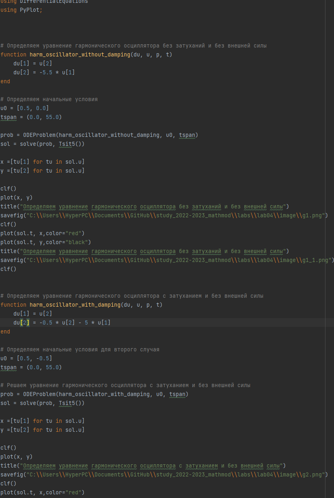
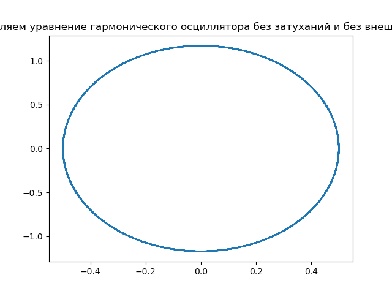
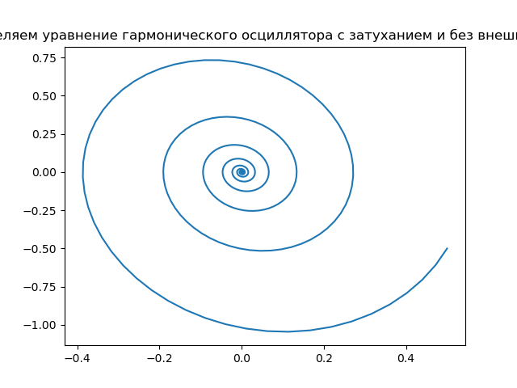
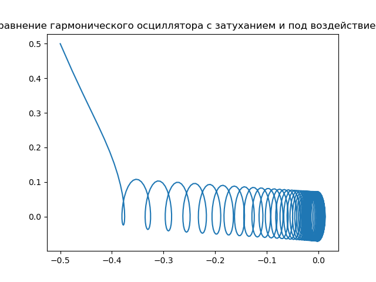
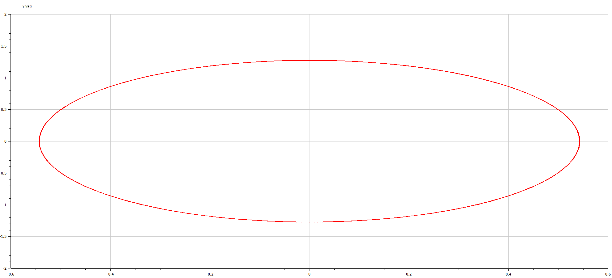
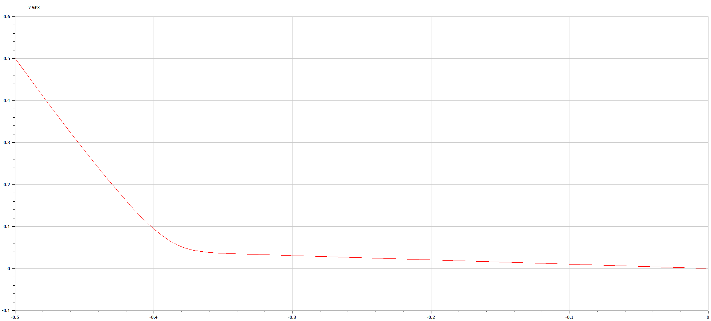

Изучение работы гармонического осциллятора.
Лабораторная работа №4

---

## Цели и задачи

1. Изучить теоретическую справку;
2. Запрограммировать решение на Julia;
3. Запрограммировать решение на OpenModelica;
4. Сравнить результаты работы программ;й

---

## Условия

Постройте фазовый портрет гармонического осциллятора и решение уравнения гармонического осциллятора для следующих случаев:

1. Колебания гармонического осциллятора без затуханий и без действий внешней силы $\ddot{x}+5.5x=0$;
2. Колебания гармонического осциллятора c затуханием и без действий внешней силы $\ddot{x}+0.5\dot{x}+5x=0$
3. Колебания гармонического осциллятора c затуханием и под действием внешней силы $\ddot{x}+5\dot{x}+0.5x=0.5cos(5t)$

---

# Процесс работы

---

## Julia 

Был написан код на Julia 

---




---

График, построенный программой для первой задачи.
 

---

График,программой построенный для второго условия.
 

---

График,программой построенный для третьего условия.
 

---

## OpenModelica 

Был написан код на OpenModelica для всех трех  слуучаев

---
```
model dassdfff
  parameter Real w(start=5.5);
  Real x(start = -0.5);
  Real y(start = 0.5);
  
  equation
    der(x)=y;
    der(y)=-w*x;
  
  annotation(experiment(StartTime = 0, StopTime = 56, Tolerance = 1e-6, Interval = 0.05));
end dassdfff;
```
---

График, построенный программой для первой задачи.


---
```
model dassdfff
  parameter Real g(start=5);
  parameter Real w(start=0.5);
  Real x(start = -0.5);
  Real y(start = 0.5);
  
  equation
    der(x)=y;
    der(y)=-g*y-w*x;
  
  annotation(experiment(StartTime = 0, StopTime = 56, Tolerance = 1e-6, Interval = 0.05));
end dassdfff;
```
---

График,программой построенный для второго условия.


---
```
model dassdfff
  parameter Real g(start=5);
  parameter Real w(start=0.5);
  Real x(start = -0.5);
  Real y(start = 0.5);
  
  equation
    der(x)=y;
    der(y)=-g*y-w*x+0.5*cos(5*time);
  
  annotation(experiment(StartTime = 0, StopTime = 56, Tolerance = 1e-6, Interval = 0.05));
end dassdfff;
```
---

График,программой построенный для третьего условия.
