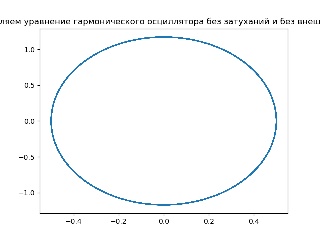
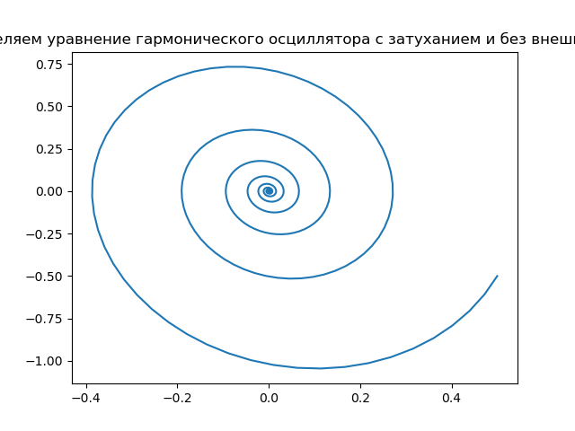
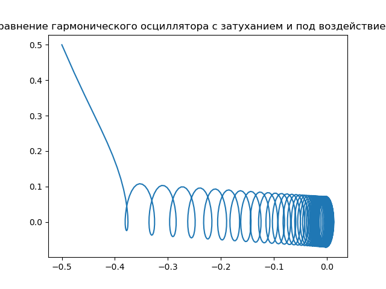
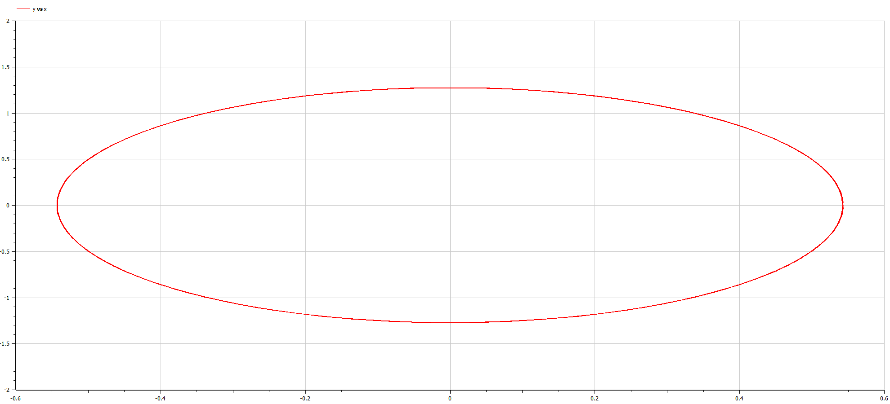
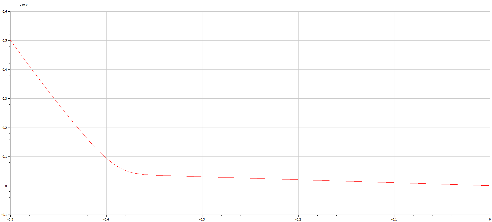
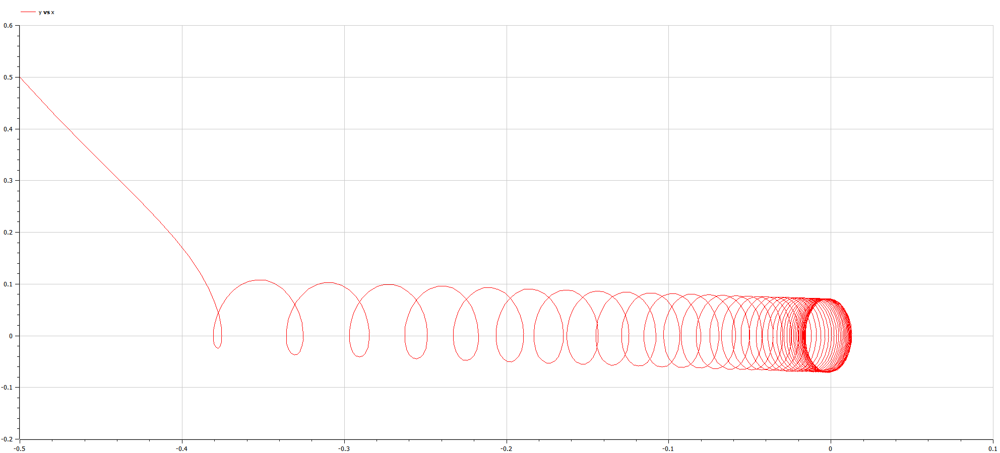

## Front matter
title: "Отчёт по лабораторной работе №4"
subtitle: "Предмет: Математическое моделирование"
author: "Носов А.А., НФИбд-01-20"

# Цель работы

Изучить работу гармонического осциллятора и решить задания лабораторной работы.

# Задание лабораторной работы
1. Изучить теоретическую справку;
2. Запрограммировать решение на Julia;
3. Запрограммировать решение на OpenModelica;
4. Сравнить результаты работы программ;
## Вариант №68 [@lab-task:mathmod]

Постройте фазовый портрет гармонического осциллятора и решение уравнения гармонического осциллятора для следующих случаев:

1. Колебания гармонического осциллятора без затуханий и без действий внешней силы $\ddot{x}+5.5x=0$;
2. Колебания гармонического осциллятора c затуханием и без действий внешней силы $\ddot{x}+0.5\dot{x}+5x=0$
3. Колебания гармонического осциллятора c затуханием и под действием внешней силы $\ddot{x}+5\dot{x}+0.5x=0.5cos(5t)$

# Теоретическое введение

## Общая информация о модели

Движение груза на пружинке, маятника, заряда в электрическом контуре, а также эволюция во времени многих систем в физике, химии, биологии и других науках при определенных предположениях можно описать одним и тем же дифференциальным уравнением, которое в теории колебаний выступает в качестве основной модели. Эта модель называется линейным гармоническим осциллятором. 

Уравнение свободных колебаний гармонического осциллятора имеет следующий вид:

$\label{eq1}\ddot{x}+2\gamma\dot{x}+{{\omega}_0}^2x=0$

где x – переменная, описывающая состояние системы (смещение грузика, заряд конденсатора и т.д.), $\gamma$ – параметр, характеризующий потери энергии (трение в механической системе, сопротивление в контуре), ${{\omega}_0}^2$ – собственная частота колебаний, t – время. (Обозначения $\ddot{x} = \frac{\partial^2 x}{\partial t^2}$, $\dot{x} = \frac{\partial x}{\partial t}$)

Уравнение $(\eqref{eq1})$ есть линейное однородное дифференциальное уравнение второго порядка и оно является примером линейной динамической системы.

При отсутствии потерь в системе ($\gamma=0$) вместо уравнения $\eqref{eq1}$ получаем уравнение консервативного осциллятора, энергия колебания которого сохраняется во времени.

$\label{eq2}\ddot{x}+{{\omega}_0}^2x=0$

Для однозначной разрешимости уравнения второго порядка $\eqref{eq2}$ необходимо задать двав начальных условия вида

$\label{eq3}\begin{cases} x(t) = x_0 \\\dot{x}(t) = y_0\end{cases}\$

Уравнение второго порядка \eqref{eq2} можно представить в виде системы двух уравнений первого порядка:

$\dot{x} = y \\\dot{y} = -{{\omega}_0}^2

$

Начальные условия \eqref{eq3} для системы (4) примут вид: 

$\begin{cases}x(t_0) = x_0 \\y(t_0) = y_0$

# Выполнение лабораторной работы

## Решение с помощью программ
### Julia
#### Программный код решения на Julia
Код программы:
```
using DifferentialEquations
using PyPlot;


# Определяем уравнение гармонического осциллятора без затуханий и без внешней силы
function harm_oscillator_without_damping(du, u, p, t)
    du[1] = u[2]
    du[2] = -5.5 * u[1]
end

# Определяем начальные условия
u0 = [0.5, 0.0]
tspan = (0.0, 55.0)

prob = ODEProblem(harm_oscillator_without_damping, u0, tspan)
sol = solve(prob, dtmax=0.05)

x =[tu[1] for tu in sol.u]
y =[tu[2] for tu in sol.u]

clf()
plot(x, y)
title("Определяем уравнение гармонического осциллятора без затуханий и без внешней силы")
savefig("C:\\Users\\HyperPC\\Documents\\GitHub\\study_2022-2023_mathmod\\labs\\lab04\\image\\g1.png")
clf()
plot(sol.t, x,color="red")
plot(sol.t, y,color="black")
title("Определяем уравнение гармонического осциллятора без затуханий и без внешней силы")
savefig("C:\\Users\\HyperPC\\Documents\\GitHub\\study_2022-2023_mathmod\\labs\\lab04\\image\\g1_1.png")
clf()


# Определяем уравнение гармонического осциллятора с затуханием и без внешней силы
function harm_oscillator_with_damping(du, u, p, t)
    du[1] = u[2]
    du[2] = -0.5 * u[2] - 5 * u[1]
end

# Определяем начальные условия для второго случая
u0 = [0.5, -0.5]
tspan = (0.0, 55.0)

# Решаем уравнение гармонического осциллятора с затуханием и без внешней силы
prob = ODEProblem(harm_oscillator_with_damping, u0, tspan)
sol = solve(prob, dtmax=0.05)

x =[tu[1] for tu in sol.u]
y =[tu[2] for tu in sol.u]

clf()
plot(x, y)
title("Определяем уравнение гармонического осциллятора с затуханием и без внешней силы")
savefig("C:\\Users\\HyperPC\\Documents\\GitHub\\study_2022-2023_mathmod\\labs\\lab04\\image\\g2.png")
clf()
plot(sol.t, x,color="red")
plot(sol.t, y,color="black")
title("Определяем уравнение гармонического осциллятора c затуханий и без внешней силы")
savefig("C:\\Users\\HyperPC\\Documents\\GitHub\\study_2022-2023_mathmod\\labs\\lab04\\image\\g2_1.png")
clf()


# Определяем уравнение гармонического осциллятора с затуханием и под воздействием внешней силы
function harm_oscillator_with_external_force(du, u, p, t)
    du[1] = u[2]
    du[2] = -5 * u[2] - 0.5 * u[1] + 0.5 * cos(5 * t)
end

# Определяем начальные условия для третьего случая
u0 = [-0.5, 0.5]
tspan = (0.0, 55.0)

# Решаем уравнение гармонического осциллятора с затуханием и под воздействванием внешней силы
prob = ODEProblem(harm_oscillator_with_external_force, u0, tspan)
sol = solve(prob, dtmax=0.05)

x =[tu[1] for tu in sol.u]
y =[tu[2] for tu in sol.u]

clf()
plot(x, y)
title("Определяем уравнение гармонического осциллятора с затуханием и под воздействием внешней силы")
savefig("C:\\Users\\HyperPC\\Documents\\GitHub\\study_2022-2023_mathmod\\labs\\lab04\\image\\g3.png")
clf()
plot(sol.t, x,color="red")
plot(sol.t, y,color="black")
title("Определяем уравнение гармонического осциллятора с затуханием и под воздействием внешней силы")
savefig("C:\\Users\\HyperPC\\Documents\\GitHub\\study_2022-2023_mathmod\\labs\\lab04\\image\\g3_1.png")
clf()
```

Результат:

### 1


<p style="text-align: center;">скриншот 1.1</p>

### 2


<p style="text-align: center;">скриншот 2.1</p>


### 3


<p style="text-align: center;">скриншот 3.1</p>


### OpenModelica

## Уравнение гармонического осциллятора без затуханий и без внешней силы

Код программы:
```
model dassdfff
  parameter Real w(start=5.5);
  Real x(start = -0.5);
  Real y(start = 0.5);
  
  equation
    der(x)=y;
    der(y)=-w*x;
  
  annotation(experiment(StartTime = 0, StopTime = 56, Tolerance = 1e-6, Interval = 0.05));
end dassdfff;
```

Результат:


<p style="text-align: center;">скриншот 1.1</p>

## Уравнение гармонического осциллятора с затуханий и без внешней силы

Код программы:
```
model dassdfff
  parameter Real g(start=5);
  parameter Real w(start=0.5);
  Real x(start = -0.5);
  Real y(start = 0.5);
  
  equation
    der(x)=y;
    der(y)=-g*y-w*x;
  
  annotation(experiment(StartTime = 0, StopTime = 56, Tolerance = 1e-6, Interval = 0.05));
end dassdfff;
```

Результат:


<p style="text-align: center;">скриншот 2.1</p>

## Уравнение гармонического осциллятора с затуханий и с внешней силы

Код программы:
```
model dassdfff
  parameter Real g(start=5);
  parameter Real w(start=0.5);
  Real x(start = -0.5);
  Real y(start = 0.5);
  
  equation
    der(x)=y;
    der(y)=-g*y-w*x+0.5*cos(5*time);
  
  annotation(experiment(StartTime = 0, StopTime = 56, Tolerance = 1e-6, Interval = 0.05));
end dassdfff;
```

Результат:


<p style="text-align: center;">скриншот 3.1</p>


## Сравнение результатов

Результаты работы программы на Julia и на OpenModelica идентичны до различий между графическими модулями. 