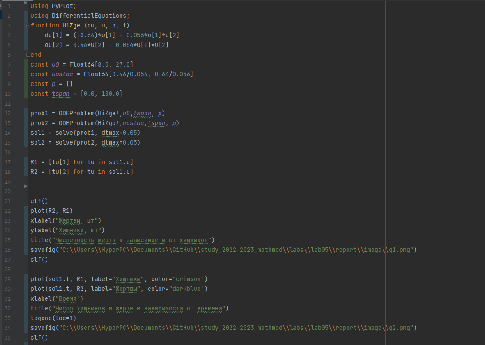
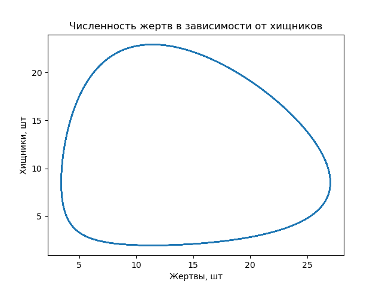
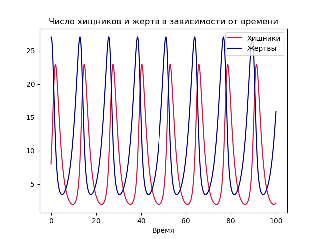
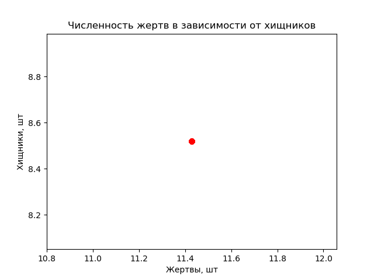
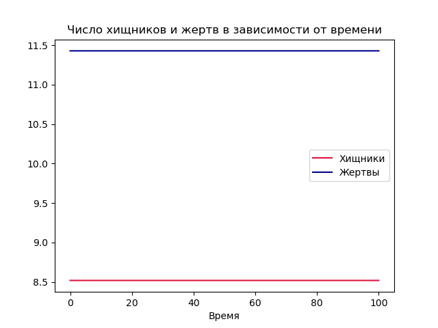
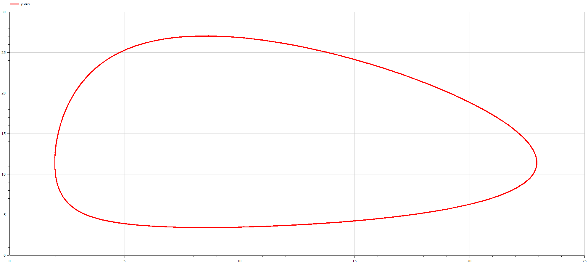
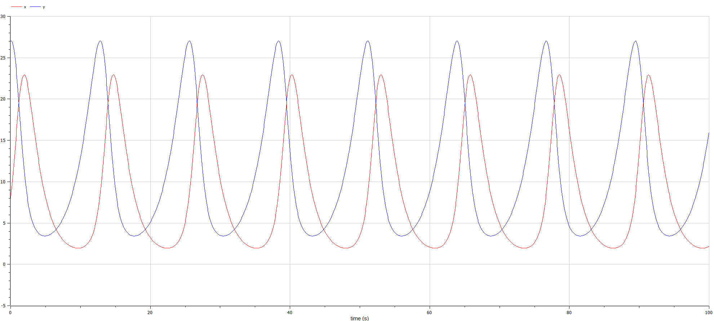

Лабораторная работа №5

---

## Цели и задачи

Изучить жёсткую модель Хищник-жертва и решить задания лабораторной работы

---

## Условия

Для модели "хищник-жертва"

\begin{equation}
\label{eq1}
\begin{cases}
\frac{dx}{dt} = -0.64x(t)+0.056x(t)y(t) \\
\frac{dy}{dt} = 0.46y(t)-0.054x(t)y(t)
\end{cases}
\end{equation}

Постройте график зависимости численности хищников от численности жертв, а также графики изменения численности хищников
и численности жертв при следующих начальных условиях: $x_0 = 8, y_0 = 27$. Найдите стационарное состояние системы.

---

# Процесс работы

---

## Julia 

Был написан код на Julia 

---




---

Решение для нестационарного состояния, заданного заданием лабораторной работы 





---

Решение для стационарного состояния, заданного заданием лабораторной работы 





---

## OpenModelica 

Был написан код на OpenModelica 

---
Решение для нестационарного состояния
```
model dddd
  Real x(start=8);
  Real y(start=27);
  parameter Real a( start=-0.64);
  parameter Real b( start=0.056);
  parameter Real c( start=0.46);
  parameter Real h( start=-0.054);

  equation
    der(x)= a*x + b*x*y;
    der(y)= c*y + h*x*y;

  annotation(experiment(StartTime=0, StopTime=100, Tolerance=1e-6, Interval=0.05));
end dddd;
```
---




---

Решение для стационарного состояния
```
model dddd
  Real x(start=0.46/0.054);
  Real y(start=0.64/0.056);
  parameter Real a( start=-0.64);
  parameter Real b( start=0.056);
  parameter Real c( start=0.46);
  parameter Real h( start=-0.054);

  equation
    der(x)= a*x + b*x*y;
    der(y)= c*y + h*x*y;

  annotation(experiment(StartTime=0, StopTime=100, Tolerance=1e-6, Interval=0.05));
end dddd;
```
---


