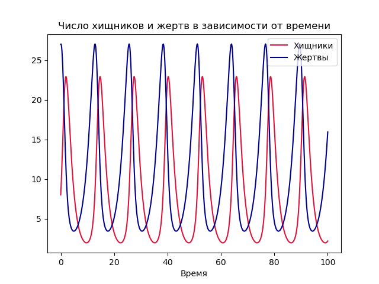
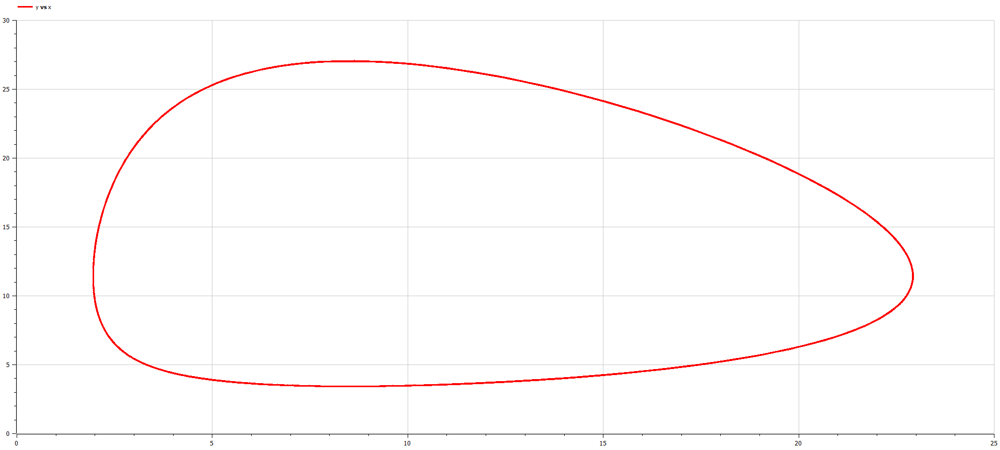

## Front matter
title: "Отчёт по лабораторной работе №5"
subtitle: "Предмет: Математическое моделирование"
author: "Носов А.А., НФИбд-01-20"

 Цель работы

Изучить жёсткую модель Хищник-жертва и решить задания лабораторной работы.

Задачи:

- Изучить теоретическую справку;
- На основании теоретической справки найти стационарное решение для задачи;
- Запрограммировать решение на Julia;
- Запрограммировать решение на OpenModelica;
- Сравнить результаты работы программ;

# Задание лабораторной работы
## Вариант №68 [@lab-task:mathmod]

Для модели "хищник-жертва"

\begin{equation}
\label{eq1}
\begin{cases}
\frac{dx}{dt} = -0.64x(t)+0.056x(t)y(t) \\
\frac{dy}{dt} = 0.46y(t)-0.054x(t)y(t)
\end{cases}
\end{equation}

Постройте график зависимости численности хищников от численности жертв, а также графики изменения численности хищников
и численности жертв при следующих начальных условиях: $x_0 = 8, y_0 = 27$. Найдите стационарное состояние системы.

# Теоретическое введение

## Общая информация о модели [@lab-example:mathmod]

Простейшая модель взаимодействия двух видов типа «хищник — жертва» - модель Лотки-Вольтерры. Данная двувидовая модель основывается на следующих предположениях:

1. Численность популяции жертв x и хищников y зависят только от времени (модель не учитывает пространственное распределение популяции на занимаемой территории)
2. В отсутствии взаимодействия численность видов изменяется по модели Мальтуса, при этом число жертв увеличивается, а число хищников падает
3. Естественная смертность жертвы и естественная рождаемость хищника считаются несущественными
4. Эффект насыщения численности обеих популяций не учитывается
5. Скорость роста численности жертв уменьшается пропорционально численности хищников

\begin{equation}
\label{eq2}
\begin{array}{l}
\frac{dx}{dt} = ax(t)-bx(t)y(t) \\
\frac{dy}{dt} = -cy(t)+dx(t)y(t)
\end{array}
\end{equation}

В этой модели $x$ – число жертв, $y$ - число хищников.
Коэффициент $a$ описывает скорость естественного прироста числа жертв в отсутствие хищников, $с$ - естественное вымирание хищников, лишенных пищи в виде жертв.
Вероятность взаимодействия жертвы и хищника считается пропорциональной как количеству жертв, так и числу самих хищников ($xy$).
Каждый акт взаимодействия уменьшает популяцию жертв, но способствует увеличению популяции хищников (члены $-bxy$ и $dxy$ в правой части уравнения).

Математический анализ этой (жёсткой) модели показывает, что имеется стационарное состояние, всякое же другое начальное состояние приводит
к периодическому колебанию численности как жертв, так и хищников, так что по прошествии некоторого времени такая система вернётся в изначальное состояние.

Стационарное состояние системы \eqref{eq2} (положение равновесия, не зависящее от времени решения) будет находиться
в точке $x_0=\frac{c}{d}, y_0=\frac{a}{b}$. Если начальные значения задать в стационарном состоянии $x(0) = x_0, y(0) = y_0$, то в любой момент времени
численность популяций изменяться не будет. При малом отклонении от положения равновесия численности как хищника, так и жертвы с течением времени не
возвращаются к равновесным значениям, а совершают периодические колебания вокруг стационарной точки. Амплитуда колебаний и их период определяется
начальными значениями численностей $x(0), y(0)$. Колебания совершаются в противофазе.

При малом изменении модели

\begin{equation}
\label{eq3}
\begin{array}{l}
\frac{dx}{dt} = ax(t)-bx(t)y(t) + \epsilon f(x,y) \\
\frac{dy}{dt} = -cy(t)+dx(t)y(t) + \epsilon g(x,y), \epsilon << 1
\end{array}
\end{equation}

(прибавление к правым частям малые члены, учитывающие, например, конкуренцию жертв за пищу и хищников за жертв), вывод о периодичности
(возвращении системы в исходное состояние B), справедливый для жесткой системы Лотки-Вольтерры, теряет силу. Таким образом, мы получаем так
называемую мягкую модель «хищник-жертва».

# Выполнение лабораторной работы

## Решение с помощью программ
### Julia
#### Программный код решения на Julia

```
using PyPlot;
using DifferentialEquations;
function HiZge!(du, u, p, t)
    du[1] = (-0.64)*u[1] + 0.056*u[1]*u[2]
    du[2] = 0.46*u[2] - 0.054*u[1]*u[2]
end
const u0 = Float64[8.0, 27.0]
const uostac = Float64[0.46/0.054, 0.64/0.056]
const p = []
const tspan = [0.0, 100.0]

prob1 = ODEProblem(HiZge!,u0,tspan, p)
prob2 = ODEProblem(HiZge!,uostac,tspan, p)
sol1 = solve(prob1, dtmax=0.05)
sol2 = solve(prob2, dtmax=0.05)

R1 = [tu[1] for tu in sol1.u]
R2 = [tu[2] for tu in sol1.u]


clf()
plot(R2, R1)
xlabel("Жертвы, шт")
ylabel("Хищники, шт")
title("Численность жертв в зависимости от хищников")
savefig("C:\\Users\\HyperPC\\Documents\\GitHub\\study_2022-2023_mathmod\\labs\\lab05\\report\\image\\g1.png")
clf()

plot(sol1.t, R1, label="Хищники", color="crimson")
plot(sol1.t, R2, label="Жертвы", color="darkblue")
xlabel("Время")
title("Число хищников и жертв в зависимости от времени")
legend(loc=1)
savefig("C:\\Users\\HyperPC\\Documents\\GitHub\\study_2022-2023_mathmod\\labs\\lab05\\report\\image\\g2.png")
clf()

R1 = [tu[1] for tu in sol2.u]
R2 = [tu[2] for tu in sol2.u]

clf()
plot(R2, R1, "ro")
xlabel("Жертвы, шт")
ylabel("Хищники, шт")
title("Численность жертв в зависимости от хищников")
savefig("C:\\Users\\HyperPC\\Documents\\GitHub\\study_2022-2023_mathmod\\labs\\lab05\\report\\image\\g3.png")
clf()

plot(sol2.t, R1, label="Хищники", color="crimson")
plot(sol2.t, R2, label="Жертвы", color="darkblue")
xlabel("Время")
title("Число хищников и жертв в зависимости от времени")
legend()
savefig("C:\\Users\\HyperPC\\Documents\\GitHub\\study_2022-2023_mathmod\\labs\\lab05\\report\\image\\g4.png")
clf()
```
#### Результаты работы кода на Julia

Решение для нестационарного состояния, заданного заданием лабораторной работы 





Решение для стационарного состояния, заданного заданием лабораторной работы 


В стационарном состоянии решение вида $y(x)=some function$ будет представлять собой точку.

### OPenModelica
#### Программный код решения на OPenModelica

Решение для нестационарного состояния
```
model dddd
  Real x(start=8);
  Real y(start=27);
  parameter Real a( start=-0.64);
  parameter Real b( start=0.056);
  parameter Real c( start=0.46);
  parameter Real h( start=-0.054);

  equation
    der(x)= a*x + b*x*y;
    der(y)= c*y + h*x*y;

  annotation(experiment(StartTime=0, StopTime=100, Tolerance=1e-6, Interval=0.05));
end dddd;
```
Решение для стационарного состояния
```
model dddd
  Real x(start=0.46/0.054);
  Real y(start=0.64/0.056);
  parameter Real a( start=-0.64);
  parameter Real b( start=0.056);
  parameter Real c( start=0.46);
  parameter Real h( start=-0.054);

  equation
    der(x)= a*x + b*x*y;
    der(y)= c*y + h*x*y;

  annotation(experiment(StartTime=0, StopTime=100, Tolerance=1e-6, Interval=0.05));
end dddd;
```

#### Результаты работы кода на OpenModelica

Решение для нестационарного состояния, заданного заданием лабораторной работы 




Решение для стационарного состояния, заданного заданием лабораторной работы 


В стационарном состоянии решение вида $y(x)=some function$ будет представлять собой точку. Почему-то в OpenModelica точка сама по себе не желает отображаться.

# Выводы

Была изучена жёсткая модель Хищник-жертва. Были запрограммированы решения для задачи лабораторной работы на Julia и OpenModelica.
Было найдено стационарное состояние системы и были построены графики численности жертв и хищников для условий задачи и для стационарного состояния.