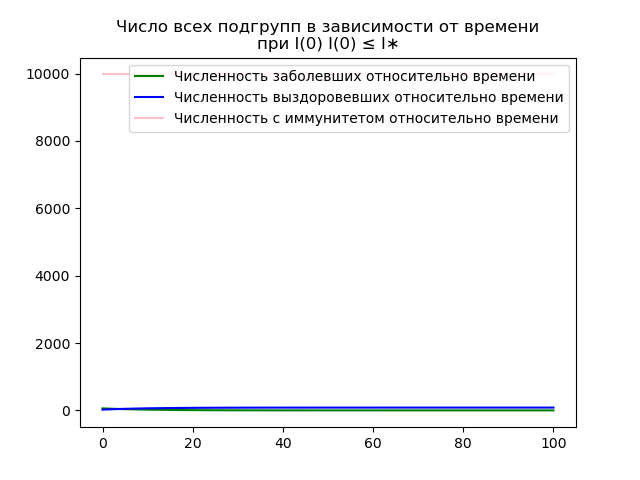
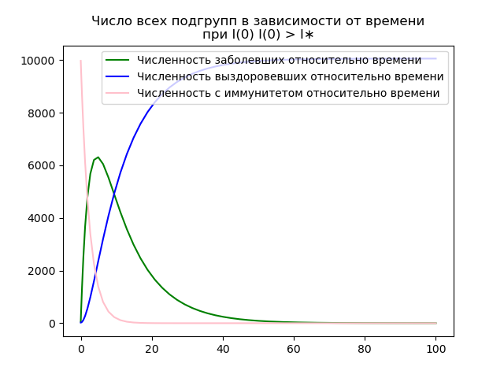
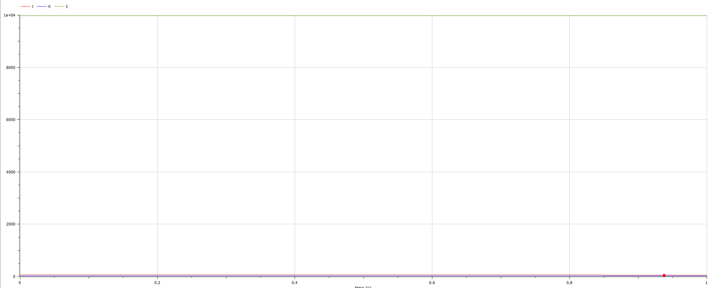
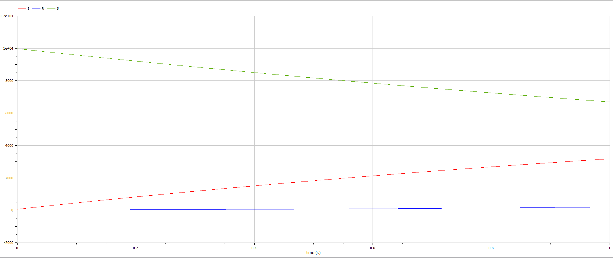

## Front matter
title: "Отчёт по лабораторной работе №6"
subtitle: "Предмет: Математическое моделирование"
author: "Носов А.А., НФИбд-01-20"

 Цель работы

Изучить простейшую модель задачи об эпидемии и решить задания лабораторной работы.

Задачи:

- Изучить теоретическую справку;
- Запрограммировать решение на Julia;
- Запрограммировать решение на OpenModelica;
- Сравнить результаты работы программ;


# Задание лабораторной работы
## Вариант №68 [@lab-task:mathmod]

На одном острове вспыхнула эпидемия. Известно, что из всех проживающих на острове ($N=10060$) в момент начала эпидемии ($t=0$) число заболевших людей (являющихся распространителями инфекции) $I(0)=62$, число здоровых людей с иммунитетом к болезни $R(0)=23$. Таким образом, число людей восприимчивых к болезни, но пока здоровых, в начальный момент времени $S(0)=N-I(0)- R(0)$. Постройте графики изменения числа особей в каждой из трех групп.

Рассмотрите, как будет протекать эпидемия в случае:

1) если $ I(0) \le I^* $
2) если $ I(0) > I^* $

# Теоретическое введение

Рассмотрим простейшую модель эпидемии. Предположим, что некая популяция, состоящая из $N$ особей, (считаем, что популяция изолирована) подразделяется на три группы. Первая группа - это восприимчивые к болезни, но пока здоровые особи, обозначим их через $S(t)$. Вторая группа – это число инфицированных особей, которые также при этом являются распространителями инфекции, обозначим их $I(t)$. А третья группа, обозначающаяся через $R(t)$ – это здоровые особи с иммунитетом к болезни.

До того, как число заболевших не превышает критического значения $I^{\ast}$, считаем, что все больные изолированы и не заражают здоровых. Когда $I(t) > I^{\ast}$, тогда инфицирование способны заражать восприимчивых к болезни особей. Таким образом, скорость изменения числа $S(t)$ меняется по следующему закону:

\begin{equation}
\label{eq1}
\frac{dS}{dt} = 
\begin{cases}
-\alpha S,&\text{если } I(t)>I^{\ast} \\
0,&\text{если } I(t) \le I^{\ast}
\end{cases}
\end{equation}

Поскольку каждая восприимчивая к болезни особь, которая, в конце концов, заболевает, сама становится инфекционной, то скорость изменения числа инфекционных особей представляет разность за единицу времени между заразившимися и теми, кто уже болеет и лечится, т.е.:

\begin{equation}
\label{eq2}
\frac{dI}{dt} = 
\begin{cases}
\alpha S - \beta I,& \text{если } I(t) > I^{\ast} \\
-\beta I,& \text{} I(t) \le I^{\ast}
\end{cases}
\end{equation}

А скорость изменения выздоравливающих особей (при этом приобретающие иммунитет к болезни):

\begin{equation}
\label{eq3}
\frac{dR}{dt} = \beta I
\end{equation}

Постоянные пропорциональности, $\alpha, beta$ - это коэффициенты заболеваемости и выздоровления соответственно. Для того, чтобы решения соответствующих уравнений определялось однозначно, необходимо задать начальные условия. Считаем, что на начало эпидемии в момент времени $t = 0$ нет особей с иммунитетом к болезни R(0)=0, а число инфицированных и восприимчивых к болезни особей $I(0)$ и $S(0)$ соответственно. Для анализа картины протекания эпидемии необходимо рассмотреть два случая:

- $I(0) \le I^{\ast}$
- $I(0) > I^{\ast}$


# Выполнение лабораторной работы

## Решение с помощью программ
### Julia
#### Программный код решения на Julia

```
using DifferentialEquations, PyPlot

# задаем начальные условия
N = 10060 # общее число людей на острове
I0 = 61 # число заболевших в начальный момент времени
R0 = 23 # число людей с иммунитетом к болезни в начальный момент времени
S0 = N - I0 - R0 # число восприимчивых к болезни людей в начальный момент времени

# задаем параметры модели
α = 0.4 # коэффициент передачи инфекции
β = 0.1 # коэффициент выздоровления

# задаем функцию правых частей системы дифференциальных уравнений
function fn_1(du, u, p, t)
    S, I, R = u
    α, β = p
    du[1] = 0
	du[2] = - β * I
	du[3] = β * I
end

# задаем начальное время, конечное время и шаг по времени
tspan = (0.0, 100.0)
dt = 0.01

# задаем начальные условия
u0 = [S0, I0, R0]

# решаем систему дифференциальных уравнений
prob1 = ODEProblem(fn_1, u0, tspan, [α, β])
sol1 = solve(prob1, Tsit5(), dt=dt)

S1 = [u[1] for u in sol1.u]
I1 = [u[2] for u in sol1.u]
R1 = [u[3] for u in sol1.u]
T1 = [timestamp for timestamp in sol1.t]

clf()
plot(T1, I1, label="Численность заболевших относительно времени", color="green")
plot(T1, R1, label="Численность выздоровевших относительно времени", color="blue")
plot(T1, S1, label="Численность с иммунитетом относительно времени", color="pink")
title("Число всех подгрупп в зависимости от времени\nпри I(0) I(0) ≤ I∗")
legend(loc=1)
savefig("C:\\Users\\HyperPC\\Documents\\GitHub\\study_2022-2023_mathmod\\labs\\lab06\\image\\graph1.png")
clf()

function fn_2(du, u, p, t)
	S, I, R = u
    α, β = p
	du[1] = - α * S
	du[2] = α * S - β * I
	du[3] = β * I
end

prob2 = ODEProblem(fn_2, u0, tspan, [α, β])
sol2 = solve(prob2, Tsit5(), dt=dt)

S2 = [u[1] for u in sol2.u]
I2 = [u[2] for u in sol2.u]
R2 = [u[3] for u in sol2.u]
T2 = [timestamp for timestamp in sol2.t]

clf()
plot(T2, I2, label="Численность заболевших относительно времени", color="green")
plot(T2, R2, label="Численность выздоровевших относительно времени", color="blue")
plot(T2, S2, label="Численность с иммунитетом относительно времени", color="pink")
title("Число всех подгрупп в зависимости от времени\nпри I(0) I(0) > I∗")
legend(loc=1)
savefig("C:\\Users\\HyperPC\\Documents\\GitHub\\study_2022-2023_mathmod\\labs\\lab06\\image\\graph2.png")
clf()

```

#### Результаты работы кода на Julia

Число всех подгрупп в зависимости от времени при I(0) I(0) ≤ I



Число всех подгрупп в зависимости от времени\nпри I(0) I(0) > I



### OPenModelica
#### Программный код решения на OPenModelica

Если $I(0) \le I^{\ast}$
```
model ddd
  Real N = 10060;
  Real S;
  Real I;
  Real R;
  Real beta = 0.1;
  Real alpha = 0.4;

initial equation
  I = 61;
  R = 23;
  S = N - I - R;

equation
  der(S) = 0;
  der(I) = - beta * I;
  der(R) = beta * I;

end ddd;
```
Если $I(0) > I^{\ast}$
```
model ddd

  Real N = 10060;
  Real S;
  Real I;
  Real R;
  Real beta = 0.1;
  Real alpha = 0.4;

initial equation
  I = 61;
  R = 23;
  S = N - I - R;

equation
  der(S) = - alpha * S;
  der(I) = alpha * S - beta * I;
  der(R) = beta * I;

end ddd;
```

#### Результаты работы кода на OpenModelica

Если $I(0) \le I^{\ast}$




Если $I(0) > I^{\ast}$




# Выводы

Была изучена модель задачи об эпидемии. Были запрограммированы решения для задачи лабораторной работы на Julia и OpenModelica.
Были построены графики численности разных подгрупп популяции для двух условий задачи.