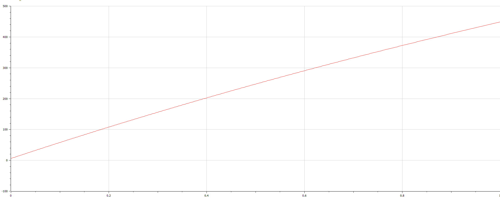

Лабораторная работа №6

---

## Цели и задачи

Изучить простейшую модель задачи об эпидемии и решить задания лабораторной работы.

---

## Условия

На одном острове вспыхнула эпидемия. Известно, что из всех проживающих на острове ($N=10060$) в момент начала эпидемии ($t=0$) число заболевших людей (являющихся распространителями инфекции) $I(0)=62$, число здоровых людей с иммунитетом к болезни $R(0)=23$. Таким образом, число людей восприимчивых к болезни, но пока здоровых, в начальный момент времени $S(0)=N-I(0)- R(0)$. Постройте графики изменения числа особей в каждой из трех групп.

Рассмотрите, как будет протекать эпидемия в случае:

- $I(0) \le I^{\ast}$
- $I(0) > I^{\ast}$

---

# Процесс работы

---

## Julia 

Был написан код на Julia 

---


---

Число всех подгрупп в зависимости от времени при I(0) I(0) ≤ I


---

Число всех подгрупп в зависимости от времени\nпри I(0) I(0) > I


---

## OpenModelica 

Был написан код на OpenModelica 

---
Решение для числа всех подгрупп в зависимости от времени при I(0) I(0) ≤ I
```
model ddd
  Real N = 10060;
  Real S;
  Real I;
  Real R;
  Real beta = 0.1;
  Real alpha = 0.4;

initial equation
  I = 61;
  R = 23;
  S = N - I - R;

equation
  der(S) = 0;
  der(I) = - beta * I;
  der(R) = beta * I;

end ddd;
```
---




---

Решение для числа всех подгрупп в зависимости от времени\nпри I(0) I(0) > I
```
model ddd

  Real N = 10060;
  Real S;
  Real I;
  Real R;
  Real beta = 0.1;
  Real alpha = 0.4;

initial equation
  I = 61;
  R = 23;
  S = N - I - R;

equation
  der(S) = - alpha * S;
  der(I) = alpha * S - beta * I;
  der(R) = beta * I;

end ddd;
```
---


